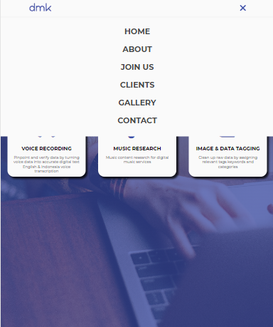
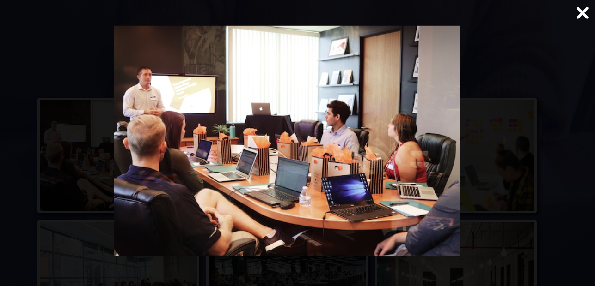
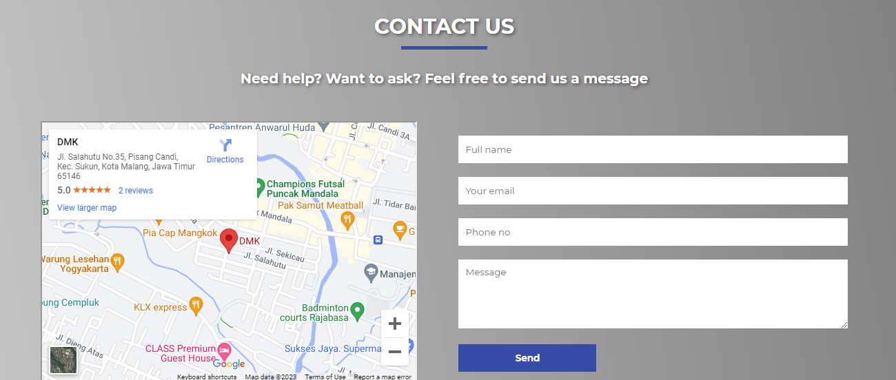
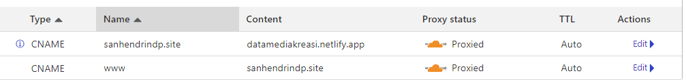
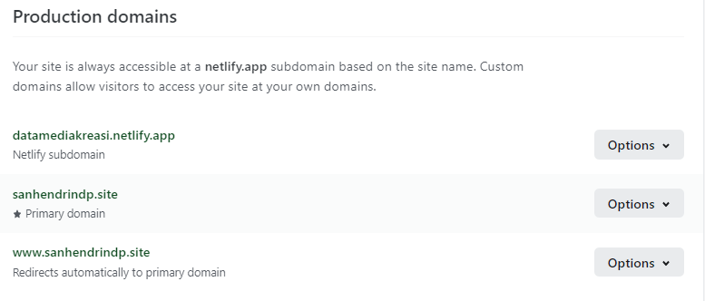
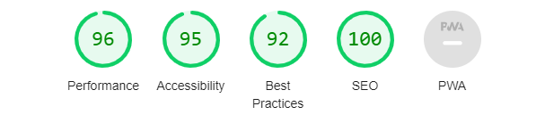
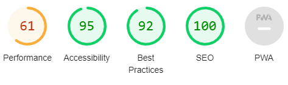

<h5 align="center">Powered by</h5>
<p align="center"> <a href="https://www.w3.org/html/" target="_blank" rel="noreferrer">  </a><a href="https://www.w3schools.com/css/" target="_blank" rel="noreferrer">  </a>  <a href="https://developer.mozilla.org/en-US/docs/Web/JavaScript" target="_blank" rel="noreferrer">  </a> </p>

<h5 align="center">Website Link</h5>

<p align="center">
<a href="https://datamediakreasi.netlify.app">datamediakreasi.netlify.app</a>
·
<a href="https://sanhendrindp.site/">sanhendrindp.site</a>
</p>

<p align="center">

</p>

# List of Contents

- [Introduction](#introduction)
- [Website Display](#website-display)
- [Design Concept](#design-concept--structure)
- [Website Feature](#website-feature)
- [External Library](#external-library)
- [Custom Domain Setting](#custom-domain-setting)
- [Lighthouse Score](#lighthouse-score)

# Introduction

In this project assignment, I created a company profile website which is based on a real company where I used to work before. This website created by only using HTML5, CSS, Vanilla Javascript, and with some help by using external library such as Font Awesome for icon purpose.

# Website Display

### On Laptop or larger view

<p align="center">

</p>

### On Mobile

<p align="center">

</p>

# Design Concept / Structure

<p align="center">

</p>

# Website Feature

### Loading screen

<p align="center">

</p>

### Hamburger button

<p align="center">

</p>

### Popup gallery

<p align="center">

</p>

### Contact form with send to email accout

<p align="center">

</p>

# External Library

For external library, i use [Font Awesome](https://fontawesome.com/) to helping me get access some beautiful icon for this website.
To use Font awesome, simply just the provided CDN below.

```css
<link
      rel="stylesheet"
      href="https://cdnjs.cloudflare.com/ajax/libs/font-awesome/6.4.0/css/all.min.css"
      integrity="sha512-iecdLmaskl7CVkqkXNQ/ZH/XLlvWZOJyj7Yy7tcenmpD1ypASozpmT/E0iPtmFIB46ZmdtAc9eNBvH0H/ZpiBw=="
      crossorigin="anonymous"
      referrerpolicy="no-referrer"
    />
```

# Custom Domain Setting

I used Cloudflare for the DNS management setting.

<p align="center">

</p>

After that, simply used Netlify to add site based on custom domains that have been set via Cloudflare.

<p align="center">

</p>

# Lighthouse Score

### On Desktop

<p align="center">

</p>

### On Mobile

<p align="center">

</p>

---

<p align="center">🙏 Thanks</p>

<p align="center">
  <a href="https://github.com/EddieHubCommunity" target="_blank" rel="noopener noreferrer">
    
 </a>
  <a href="https://github.com/EddieHubCommunity" target="_blank" rel="noopener noreferrer">
    
 </a>
  <a href="https://github.com/EddieHubCommunity" target="_blank" rel="noopener noreferrer">
    
 </a>
 </p>
